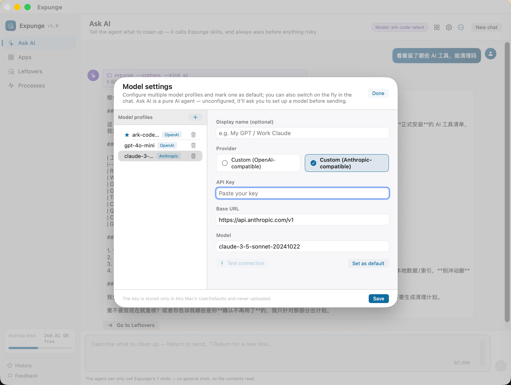
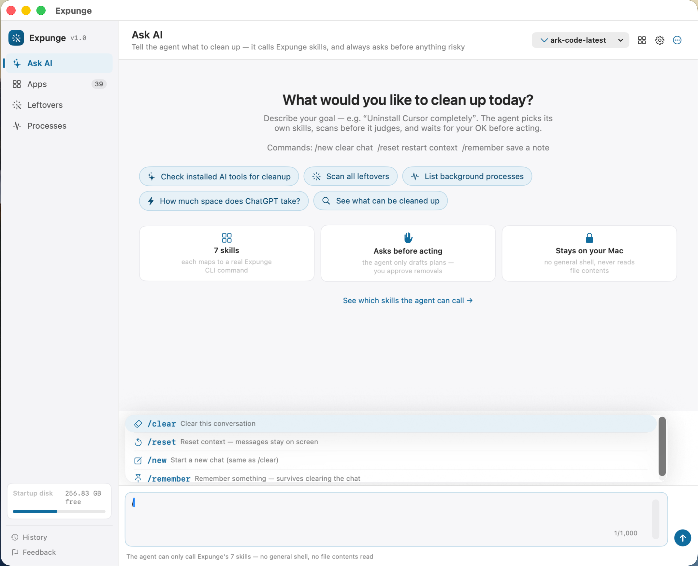
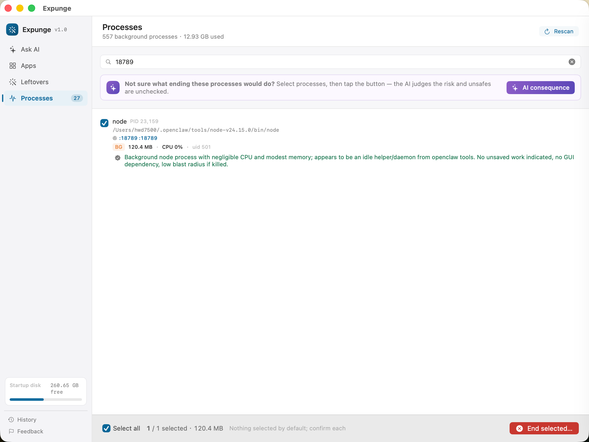
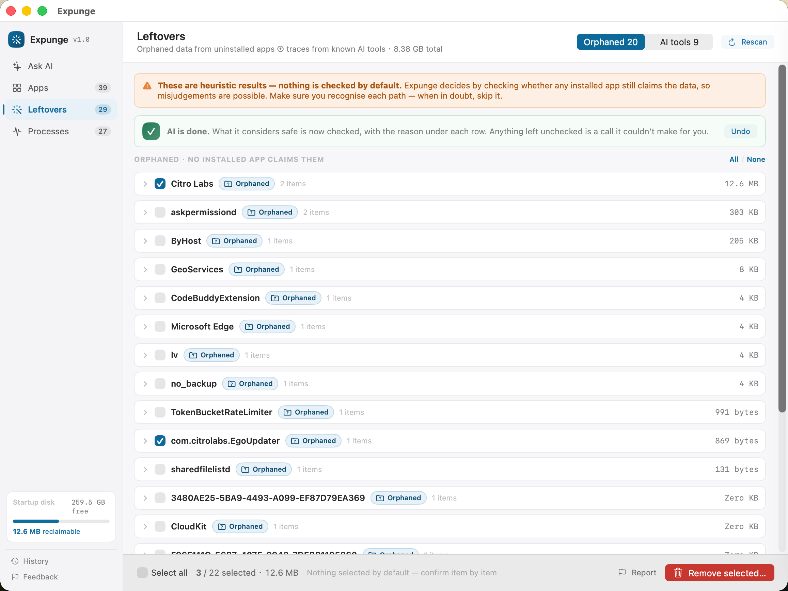

# AI Mac Cleaner

**The macOS uninstaller that actually removes everything.**

[简体中文](README.zh-CN.md) | **English**

Free, open-source, and thorough. Uninstall any Mac app — and sweep up every trace it left behind: Homebrew formulas, npm/pipx packages, sandbox containers, launch agents, shell config pollution, dotfiles, caches, and more. 16 scanner categories, zero leftovers.

**User data goes to Trash** — chat logs, configs, accounts stay recoverable. Caches and system files are permanently removed so they don't clutter your machine.

> **System Requirements:** macOS 14 (Sonoma) or later. Intel & Apple Silicon. [Why macOS 14?](#system-requirements)


---

## Features

### 🧹 Deep Uninstall
Select an app, AI Mac Cleaner finds everything connected to it. Not just the `.app` bundle — dependencies, preferences, caches, logs, containers, and CLI tools installed by package managers. Confirm once, it's all gone.


### 🔍 Orphan Scanner
Apps you deleted months ago often leave data behind. The orphan scanner reverse-looks: which `~/Library` directories have no living app to claim them? Finds forgotten leftovers you didn't even know existed.


### 🤖 AI Agent ("Ask AI")
Describe what you want in natural language — "uninstall Cursor completely" or "scan all leftovers" — and the built-in AI agent calls the right skills, inspects the results, and drafts a plan. Nothing is removed without your explicit confirmation.


#### Configure a Model
Open ⚙ **Settings → Configure AI model** and add an API key. OpenAI, Anthropic, and any compatible provider work. Multiple profiles are supported — switch between them in the Ask AI toolbar.



#### Slash Commands
Type `/` in the input box to see available commands:

| Command | What It Does |
|---------|--------------|
| `/new` | Start a fresh conversation (clears chat history) |
| `/reset` | Restart the agent context |
| `/remember` | Save a correction so it survives `/new` and session restarts |



#### AI Consequence (Processes)
Select one or more processes, tap **AI consequence** — the agent judges what ending each process would do. Low-risk ones get auto-selected; the rest get unchecked with a reason underneath.



#### AI Review (Apps & Leftovers)
Tap **Ask AI** in the Apps or Leftovers tab. The agent inspects your uninstall list and automatically unchecks anything it thinks should be kept (login state, shared data, credentials) — with a reason under each row.



### 🖥️ Process Manager
See every background process running on your Mac — node servers, Python scripts, Docker containers, Brew services. Shows memory usage, CPU %, and **listening ports** (e.g. `:3000`, `:8080`). Search by port number to find exactly which process is holding it. Kill with one click.


### 🛡️ Safety by Design
- **User data → Trash.** Chat logs, config files, and account data go to Trash — recoverable until you empty it. Caches and system files are removed permanently.
- **No shell access.** The AI agent can only call predefined, read-only skills. It can't run arbitrary commands, read arbitrary files, or access the network.
- **Confirmation required.** Every removal action asks for confirmation. No silent deletions.
- **System protection.** Critical system processes and paths are whitelisted and can never be removed.
- **Offline-first.** All processing is local. No data leaves your machine.

---

## Installation

### Download DMG (Recommended)

Download `AI Mac Cleaner-<version>.dmg` and its `.sha256` from [Releases](https://github.com/hwd8080-ai/AIMacCleaner/releases). Verify first:

```bash
shasum -a 256 -c AI Mac Cleaner-<version>.dmg.sha256   # Should print OK
```

Open the DMG, drag AI Mac Cleaner to Applications. First launch: **right-click → Open** (required for unsigned apps).

### Build from Source

```bash
git clone https://github.com/hwd8080-ai/AIMacCleaner.git
cd AIMacCleaner
./build_app.sh                       # → /Applications/AIMacCleaner.app
open /Applications/AIMacCleaner.app
```

To build a DMG for distribution:

```bash
./build_release.sh                   # → dist/AIMacCleaner-<version>.dmg + .sha256
```

### CLI Only

```bash
swift build -c release
.build/release/AIMacCleaner --scan "WeChat"   # Scan an app
.build/release/AIMacCleaner --self-test       # Run self-tests
.build/release/AIMacCleaner --skills          # List agent skills
```

---

## How It Works

AI Mac Cleaner scans across 16 categories:

| Category | What It Finds |
|----------|--------------|
| `.app` bundles | Installed applications |
| Homebrew | Formulas, casks, taps |
| npm / pipx | Global packages |
| Sandbox containers | `~/Library/Containers` data |
| Launch agents | `~/Library/LaunchAgents` plists |
| Shell configs | `.zshrc`, `.bashrc`, `.fish` entries |
| Dotfiles | `.cursor`, `.claude`, config dirs |
| Caches | `~/Library/Caches` |
| Preferences | `~/Library/Preferences` plists |
| Logs | `~/Library/Logs` |
| Auth tokens | Keychain-adjacent credential files |
| AI tool data | Claude Code, Cursor, Windsurf, Copilot, and 20+ more |
| Orphaned data | Library dirs with no owning app |
| XDG dirs | `~/.config`, `~/.local/share` |
| MAS receipts | Mac App Store install records |
| Application Support | `~/Library/Application Support` |

---

## AI Agent Skills

The built-in agent has 7 skills it can call:

| Skill | Description |
|-------|-------------|
| `list_apps` | List all installed applications |
| `scan_app` | Deep-scan a specific app |
| `scan_leftovers` | Find orphaned and AI tool leftovers |
| `list_processes` | List running background processes |
| `review_plan` | Review a pending uninstall plan |
| `plan_uninstall` | Draft an uninstall plan for review |
| `show_history` | Show past uninstall history |

All skills are read-only by default. The agent drafts plans — you approve removals.

---

## FAQ

**Is it safe?** Yes. User data (chat logs, configs, accounts) goes to Trash — recoverable. Caches and system files are permanently removed after confirmation. System paths are protected. Never fully automated.

**Does it phone home?** No. No analytics, no telemetry, no network requests. All processing is local.

**Why not use AppCleaner / CleanMyMac?** Those are closed-source, some are paid, and none combine package manager cleanup, orphan scanning, AI assistance, and process management in one tool.

**Can I redistribute it?** Yes. MIT licensed. See [LICENSE](LICENSE).

---

## System Requirements

| Requirement | Minimum |
|-------------|---------|
| macOS | **14.0 (Sonoma)** or later |
| Architecture | Intel (x86-64) or Apple Silicon (arm64) |
| Disk | ~25 MB installed |

> **Why macOS 14?** AI Mac Cleaner uses SwiftUI APIs introduced in Sonoma — `.onKeyPress` for rich keyboard input handling, and the modern `.onChange(of:)` closure syntax. Supporting older versions would require replacing these with legacy equivalents, adding maintenance burden for a small team. Sonoma was released in 2023 and runs on all Macs from 2018 onward.

---

## License

MIT © AI Mac Cleaner contributors
