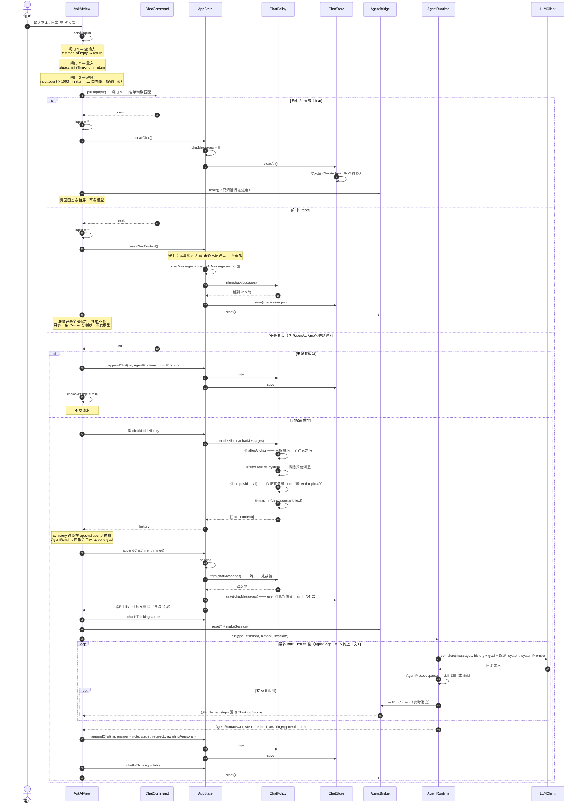
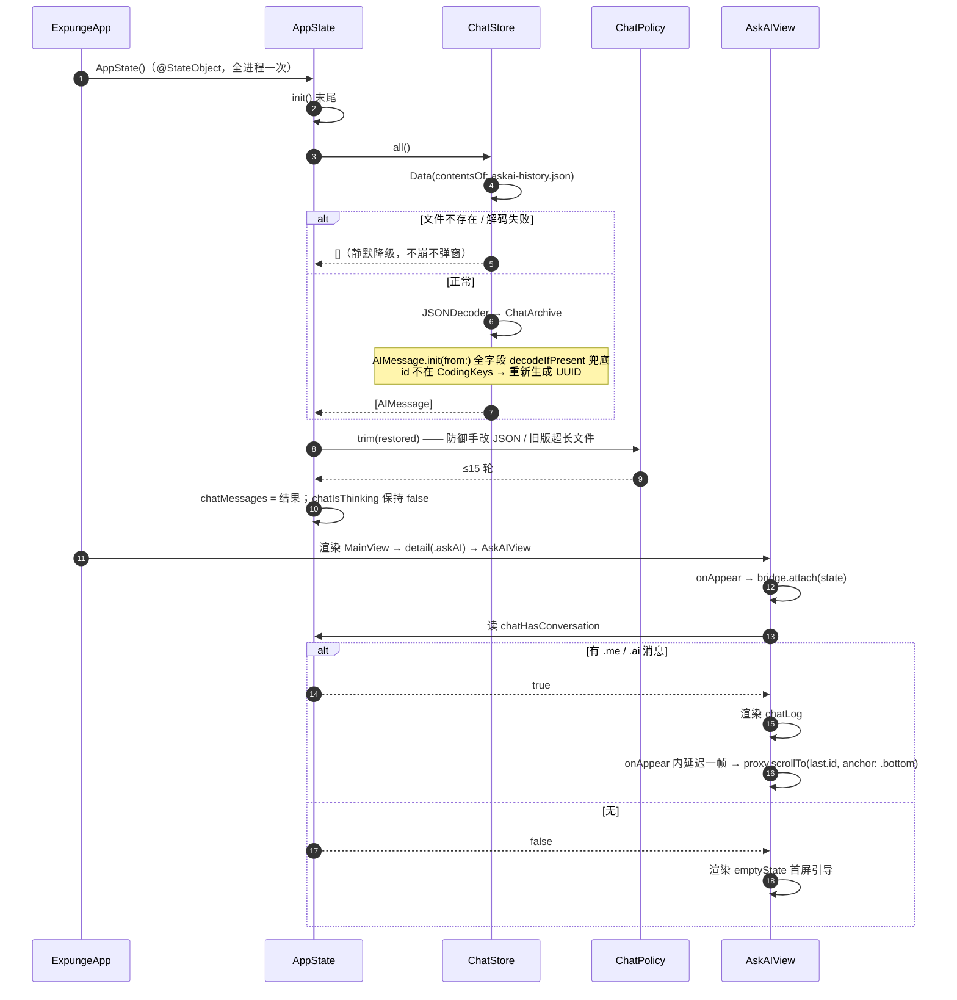
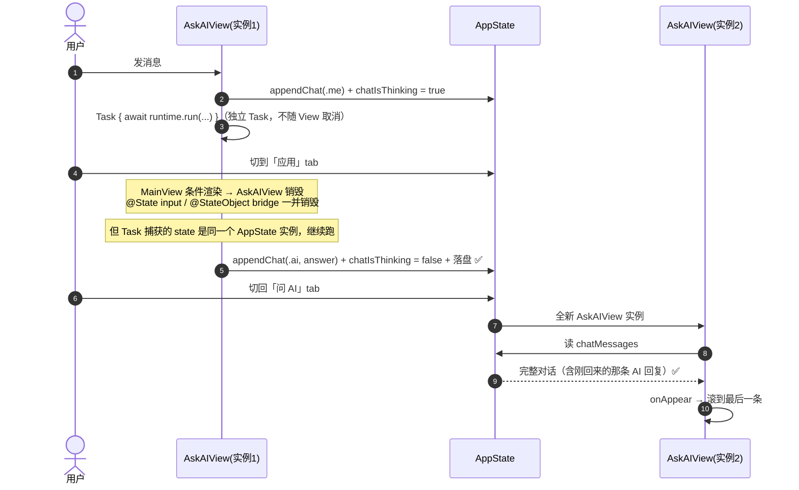
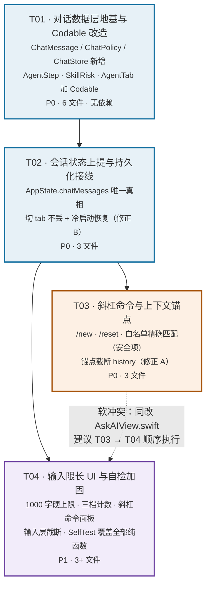

# 「问 AI」Sprint A 增量系统设计

> 项目：Expunge（macOS 深度卸载工具）· Swift + SwiftUI + SwiftPM
> 范围：`问 AI` tab 的四项增量能力（对话持久化 / 斜杠命令 / 上下文裁剪 / 输入限长）
> 架构师：高见远　|　基于许清楚的增量 PRD + 主理人齐活林的拍板规格
> 性质：**增量改造**，不重造轮子、不引新依赖

---

## 一、实现方案与框架选型

### 1.1 核心难点

读完现有代码后，真正的难点不是"加四个功能"，而是这四个功能全部撞在同一处架构缺陷上：

| # | 难点 | 本质 |
|---|------|------|
| D1 | 对话状态活不过一次 tab 切换 | `MainView.detail` 用 `switch state.selectedTab` **条件渲染**，`AskAIView` 被销毁重建，`@State messages` 随之归零。持久化再完善也救不了"切走再切回就空了"。 |
| D2 | `/reset` 找不到落点 | `bridge.reset()` 只清 `runningCommand`/`steps`，且 `send()` 已在请求前后各调一次 —— 它天然是空操作，语义上跟"上下文"毫无关系。 |
| D3 | 全链路没有一个类型是 `Codable` | `AIMessage` / `AgentStep` / `AgentTab` / `SkillRisk` 全部裸奔，且两个 `id` 都是 `let id = UUID()`（有默认值的 `let`，自动合成会告警且不参与解码）。 |
| D4 | 三处裁剪容易各写各的 | 屏幕、发模型的 history、落盘 JSON —— 分三处实现必然漂移。 |
| D5 | 新增 `.system` 角色会毒化模型输入 | 现有映射 `$0.role == .me ? "user" : "assistant"` 是**二分**逻辑，加第三个 case 后系统消息会被当 assistant 喂给模型。 |

### 1.2 解法主线：一条不变量收敛全部四个功能

> **`AppState.chatMessages` 是「问 AI」对话的唯一真相，且恒满足：已裁到 ≤15 轮、已落盘。**

把这条不变量立住之后，四个功能全部退化成它的推论：

- **持久化**：不变量里的"已落盘" → 每次变更同步写 JSON；启动时读回来即恢复（D1、D3 一并解决）
- **上下文裁剪**：不变量里的"已裁到 ≤15 轮" → 屏幕直接渲染 `chatMessages`、落盘直接写 `chatMessages`、发模型从 `chatMessages` 派生 —— **只有一处裁剪代码**（D4 解决）
- **斜杠命令**：`/new` = 清空数组，`/reset` = 往数组里插一条锚点 —— 都是对同一个数组的操作（D2 解决）
- **输入限长**：纯 View 层，不碰数组

D5 通过把"派生发模型 history"收进一个纯函数解决，二分映射的死角被这个函数唯一地封死。

### 1.3 框架与依赖选型

**结论：零新增依赖。** `Package.swift` 一行不改。

| 需求 | 选型 | 理由 |
|------|------|------|
| 本地持久化 | `Foundation` 的 `JSONEncoder/Decoder` + `Data.write(to:)` | 直接复刻 `FeedbackStore` 的成熟模式（同目录 `~/Library/Application Support/Expunge/`、同容错策略）。引 SQLite/CoreData 对一个上限 30 条消息的数组是荒谬的。 |
| 状态管理 | 既有 `AppState: ObservableObject` + `@Published` | 项目已统一用它，`AskAIView` 已经 `@EnvironmentObject` 拿到了 —— 上提是零成本的。 |
| 命令匹配 | Swift 原生 `switch` 精确匹配（**不用 `NSRegularExpression`**） | 见 §3.4，这是安全项，正则的锚点/元字符陷阱不值得冒。 |
| 文案 | 既有 `L10n.t(zh, en)` | 不改 L10n.swift，全部内联。 |
| 配色 | 既有 `Theme` 令牌 | 超限红复用 `Theme.destructive`，**不新增色板令牌**（符合项目"设计令牌"精神）。 |

### 1.4 架构分层（改造后）

```
UI 层        AskAIView            ── 只负责「看」和「收键盘」，不持有对话状态
               │  读 state.chatMessages / 调 state.xxxChat()
状态层      AppState              ── 持有 chatMessages（唯一真相）+ 维护不变量
               │  调 ChatPolicy 裁剪 / 调 ChatStore 落盘
策略层      ChatPolicy            ── 纯函数：命令白名单 · 裁剪窗口 · 锚点截断 · 限额常量
存储层      ChatStore             ── 哑 I/O：读 / 写 / 清，不做任何业务判断
模型层      AIMessage             ── Codable 数据结构（从 AskAIView.swift 迁出）
Agent 层    AgentRuntime/Bridge   ── 只补 Codable，行为一行不改
```

**关键分层决策：`ChatPolicy` 全部是无状态纯函数（`enum` 作命名空间）**。它不 import SwiftUI、不碰 MainActor、不碰文件系统 —— 所以能被 `SelfTest` 直接、彻底地覆盖。斜杠命令白名单是本次唯一的安全项，它必须是可自检的纯函数，不能藏在 View 的 `send()` 里。

---

## 二、文件列表

### 2.1 新增（3 个）

| 路径 | 职责 |
|------|------|
| `Sources/Expunge/Models/ChatMessage.swift` | `AIMessage`（从 `AskAIView.swift` **迁入**）+ 三态 `Role` + `isAnchor` + `Codable` 实现 |
| `Sources/Expunge/Models/ChatStore.swift` | `ChatArchive` 信封 + `ChatStore` 单例（`all` / `save` / `clearAll`） |
| `Sources/Expunge/Models/ChatPolicy.swift` | `ChatCommand` 白名单解析 + `ChatPolicy` 裁剪/锚点/派生纯函数 + 三个限额常量 |

> 为什么 `AIMessage` 要从 `AskAIView.swift` 迁到 `Models/`：改造后它被 `AppState`（状态层）、`ChatStore`（存储层）、`ChatPolicy`（策略层）三处引用，已经不是 View 的私有模型了，留在 View 文件里是分层错误。**并且**——迁到 `Models/ChatMessage.swift` 后，`Codable` 一致性可以声明在类型原声明处，`encode(to:)` 得以自动合成，只需手写 `init(from:)`；若用跨文件 `extension` 声明一致性，Swift 拒绝自动合成，两个方法都得手写。这是一次纯收益的搬家（Swift 全模块编译，`internal` 可见性不变，零调用点改动）。

### 2.2 修改（6 个）

| 路径 | 改动 |
|------|------|
| `Sources/Expunge/AppState.swift` | 新增 `chatMessages` / `chatIsThinking` 两个 `@Published` + 5 个方法 + 2 个派生属性；`init()` 末尾调 `restoreChat()` |
| `Sources/Expunge/UI/AskAIView.swift` | 删除 `AIMessage` 定义（已迁出）；`@State messages`/`isThinking` → `state.*`；`send()` 前置命令分流；`SystemDivider` 新组件；空态判定；字数计数；`chatLog` 恢复滚动 |
| `Sources/Expunge/Agent/AgentRuntime.swift` | `AgentStep` 加 `Codable` + `CodingKeys`（排除 `id`）+ 容错 `init(from:)`。**运行逻辑一行不改** |
| `Sources/Expunge/Agent/Skill.swift` | `enum SkillRisk: String` → `: String, Codable`；`enum AgentTab: String, Sendable` → `: String, Codable, Sendable`。仅两行 |
| `Sources/Expunge/Agent/AgentBridge.swift` | **仅补文档注释**，钉死 `reset()` 的语义边界（防止后人再次误以为它能重置会话）。零行为改动 |
| `Sources/Expunge/SelfTest.swift` | 新增一组 `Check`：命令白名单（含全部反例）、裁剪窗口、锚点截断、Codable 往返 |

### 2.3 明确不改

`Package.swift`（零新增依赖）、`UI/MainView.swift`（条件渲染保持原样，状态上提后它已无问题）、`UI/Theme.swift`（复用既有令牌）、`Models/LLMClient.swift`、`Models/AIModelConfig.swift`（**不加 context-window 字段**）、`Models/FeedbackStore.swift`。

---

## 三、数据结构与接口

### 3.1 类图

```mermaid
classDiagram
    direction LR

    class AIMessage {
        <<struct>>
        +UUID id
        +Role role
        +String text
        +AgentStep[] steps
        +AgentTab? redirect
        +Bool awaitingApproval
        +Bool isAnchor
        +init(role, text, steps, redirect, awaitingApproval, isAnchor)
        +init(from~Decoder~) throws
        +static anchor() AIMessage
    }
    note for AIMessage "Identifiable, Codable, Equatable\nCodingKeys 排除 id：解码时重新生成\nid 仅用于 ForEach / scrollTo，不跨会话引用"

    class Role {
        <<enumeration>>
        me
        ai
        system
    }
    note for Role "String RawValue + Codable\n.system 专用于锚点分割线，不喂模型"

    class AgentStep {
        <<struct>>
        +UUID id
        +String skill
        +String command
        +String summary
        +Bool ok
        +SkillRisk risk
        +init(from~Decoder~) throws
    }
    note for AgentStep "本次新增 Codable\nCodingKeys 排除 id\n运行逻辑不变"

    class SkillRisk {
        <<enumeration>>
        readOnly
        mutating
        destructive
    }

    class AgentTab {
        <<enumeration>>
        apps
        leftovers
        processes
    }

    class ChatArchive {
        <<struct>>
        +Int version
        +AIMessage[] messages
    }

    class ChatStore {
        <<final class, singleton>>
        +static ChatStore shared
        -URL url
        -init()
        +all() AIMessage[]
        +save(AIMessage[]) Void
        +clearAll() Void
    }
    note for ChatStore "哑 I/O，不做裁剪不做判断\n~/Library/Application Support/Expunge/askai-history.json\n目录自动创建 · 读写失败静默降级"

    class ChatCommand {
        <<enumeration>>
        new
        reset
        +static parse(String) ChatCommand?
    }
    note for ChatCommand "白名单精确匹配\ntrim + lowercased 后全等\n/clear 是 /new 的静默别名"

    class ChatPolicy {
        <<enum, namespace>>
        +static Int maxContextTurns$
        +static Int maxInputChars$
        +static Int inputWarnThreshold$
        +static trim(AIMessage[]) AIMessage[]
        +static afterAnchor(AIMessage[]) AIMessage[]
        +static modelHistory(AIMessage[]) Tuple[]
        +static hasConversation(AIMessage[]) Bool
    }
    note for ChatPolicy "全部无状态纯函数\n不 import SwiftUI · 不碰 MainActor · 不碰 FS\n→ SelfTest 可 100% 覆盖"

    class AppState {
        <<MainActor, ObservableObject>>
        +AIMessage[] chatMessages
        +Bool chatIsThinking
        +Bool chatHasConversation
        +Tuple[] chatModelHistory
        +restoreChat() Void
        +appendChat(AIMessage) Void
        +clearChat() Void
        +resetChatContext() Void
        -persistChat() Void
    }
    note for AppState "chatMessages 是 private(set)\n不变量：恒已裁到 ≤15 轮 且 恒已落盘"

    class AskAIView {
        <<View>>
        -String input
        -Bool showSettings
        -AgentBridge bridge
        -send(String) Void
        -runNewChat() Void
        -runResetContext() Void
        -Bool canSend
        -Int inputCount
    }
    note for AskAIView "不再持有 messages / isThinking\n全部读写 state.*"

    class AgentBridge {
        <<MainActor, ObservableObject>>
        +String? runningCommand
        +AgentStep[] steps
        +reset() Void
    }
    note for AgentBridge "语义边界钉死：\nreset() 只清「本次运行的实时进度」\n与「对话上下文」无关"

    class AgentRuntime {
        <<struct>>
        +Int maxTurns
        +run(goal, history, session) AgentRun
    }
    note for AgentRuntime "maxTurns=4 是 agent loop 轮数\n与 ChatPolicy.maxContextTurns=15 完全无关"

    AIMessage *-- Role : 持有
    AIMessage o-- AgentStep : 0..n
    AIMessage ..> AgentTab : 可选引用
    AgentStep *-- SkillRisk : 持有
    ChatArchive o-- AIMessage : 封装 0..n
    ChatStore ..> ChatArchive : 编解码
    AppState o-- AIMessage : 持有唯一真相
    AppState ..> ChatStore : 落盘 / 读盘
    AppState ..> ChatPolicy : 裁剪 / 派生
    AskAIView ..> AppState : 读写对话状态
    AskAIView ..> ChatCommand : 输入分流
    AskAIView ..> ChatPolicy : 读限额常量
    AskAIView o-- AgentBridge : StateObject
    AskAIView ..> AgentRuntime : 发起一次运行
```



### 3.2 `AIMessage`（新文件 `Models/ChatMessage.swift`）

```swift
struct AIMessage: Identifiable, Codable, Equatable {
    let id = UUID()
    let role: Role
    let text: String
    var steps: [AgentStep] = []
    var redirect: AgentTab? = nil
    var awaitingApproval: Bool = false
    /// 上下文锚点标记。true = 这是一条 `/reset` 打下的分割线，
    /// 发往模型的 history 只取它之后的消息。
    var isAnchor: Bool = false

    enum Role: String, Codable { case me, ai, system }

    /// 造一条锚点消息。text 落盘存本地化文案（便于人肉读 JSON），
    /// 但渲染时以 isAnchor 为准实时取 L10n —— 切语言后旧锚点也跟着变。
    static func anchor() -> AIMessage

    private enum CodingKeys: String, CodingKey {
        case role, text, steps, redirect, awaitingApproval, isAnchor
        // ⚠️ 故意不含 id
    }

    init(from decoder: Decoder) throws   // 全字段 decodeIfPresent 兜底，见 §3.6
}
```

**`.system` 角色的使用边界（硬规则）**：

> `.system` **只用于 `/reset` 的锚点分割线**，不用于任何其它用途。

特别地，**未配置模型时的 `AgentRuntime.configPrompt` 提示保持 `.ai` 不变**。理由：空态判定（§3.8）是"不存在 `.me`/`.ai` 消息"，若把 configPrompt 改成 `.system`，用户在未配模型时发消息会看到空态首屏而不是那条提示 —— 直接功能回归。它作为 `.ai` 会进 history 是既有行为，且已被 §3.5 的 `dropLeadingAssistant` 规则顺带修掉了真正的危害。

### 3.3 `ChatStore`（新文件 `Models/ChatStore.swift`）

完全复刻 `FeedbackStore` 的形状与容错策略：

```swift
/// 落盘信封。带 version 是为了将来改结构时能做迁移，
/// 而不是靠"解码失败就清空"来收场。
struct ChatArchive: Codable {
    var version: Int = 1
    var messages: [AIMessage]
}

final class ChatStore {
    static let shared = ChatStore()
    private let url: URL      // ~/Library/Application Support/Expunge/askai-history.json

    private init()            // 目录不存在时 createDirectory(withIntermediateDirectories: true)

    /// 读盘。文件不存在 / 解码失败 → 返回 []。不崩、不弹窗、不打断用户。
    func all() -> [AIMessage]

    /// 整体覆写。编码或写入失败 → 静默降级（try?）。
    func save(_ messages: [AIMessage])

    /// 写入空数组（与 FeedbackStore.clearAll 同形）。
    func clearAll()
}
```

**职责边界（重要）**：`ChatStore` 是**哑存储**，不做任何裁剪、不做任何业务判断。裁剪的责任 100% 在 `AppState`（写前裁、读后裁）。这样 `ChatStore` 和 `FeedbackStore` 保持同一种极简形状，谁来看都不会误会。

**落盘时机**：`chatMessages` 的**每一次**变更后立即同步写盘 —— 包括 append user 消息时（不等 AI 回复），这样中途崩溃或退出，用户问出去的那句话不丢。一次完整对话最多写 2 次，30 条消息编码 + 写盘在 SSD 上约 1–3ms，与 `FeedbackStore` 同步主线程写盘同一量级，不引入异步复杂度。

### 3.4 `ChatCommand` —— 白名单精确匹配（安全项）

```swift
enum ChatCommand {
    case new      // /new  （/clear 是它的同义写法，补全面板里两条都会列出、行为完全一致）
    case reset    // /reset
    /// 整条输入 trim + lowercased 后**全等**白名单才命中；否则返回 nil（照常发模型）。
    static func parse(_ raw: String) -> ChatCommand?
}
```

**实现方式：用 Swift 原生 `switch` 全等匹配，不用 `NSRegularExpression`。**

主理人给的规格是正则 `^/(new|clear|reset)$`（忽略大小写）。语义我完全照办，但实现上我选择等价的字符串全等：

```
let t = raw.trimmingCharacters(in: .whitespacesAndNewlines).lowercased()
switch t {
case "/new", "/clear": return .new
case "/reset":         return .reset
default:               return nil
}
```

**为什么不用正则**——这是本次唯一的安全项，而 `NSRegularExpression` 在这里有三个能出事的地方：漏写 `^`/`$` 就变成"包含即命中"（`/Users/new/x` 直接被吞掉，用户的路径查询被当成清空指令）、`try?` 构造失败时会静默降级成"永不命中"或"永远命中"取决于怎么写、`.caseInsensitive` 选项容易被后人重构掉。字符串全等**没有任何一种写错的方式能退化成"以 / 开头就吞"**，而且零分配、可读、`SelfTest` 一眼能核对。`Swift.String.lowercased()` 走 Unicode 默认大小写映射、不受 locale 影响（无土耳其语 I/i 问题）。

**必须通过的判定表**（`SelfTest` 逐条覆盖）：

| 输入 | 结果 | 说明 |
|------|------|------|
| `/new` `/NEW` `/New` | `.new` | 忽略大小写 |
| `  /reset  ` | `.reset` | 首尾空白 trim |
| `/clear` | `.new` | 静默别名 |
| `/Users/lh/Documents` | `nil` → 发模型 | **安全反例：绝不能被吞** |
| `/tmp/x` | `nil` → 发模型 | **安全反例** |
| `/new foo` | `nil` → 发模型 | 带空格不是命令 |
| `/newsletter` | `nil` → 发模型 | 前缀不算 |
| `/resetting` | `nil` → 发模型 | 前缀不算 |
| `//new` | `nil` → 发模型 | 双斜杠不是命令 |
| `帮我清理一下` | `nil` → 发模型 | 普通句子 |
| `` (空) | `nil` | 上游 `canSend` 已拦 |

### 3.5 `ChatPolicy` —— 裁剪与派生（纯函数）

```swift
enum ChatPolicy {
    /// 上下文保留轮数。1 轮 = 1 条 .me + 1 条 .ai，即最多 30 条。
    /// ⚠️ 与 AgentRuntime.maxTurns（=4，单次 agent loop 的决策轮数）完全无关，别混。
    static let maxContextTurns = 15
    static let maxInputChars = 1000
    static let inputWarnThreshold = 900

    static func trim(_ messages: [AIMessage], maxTurns: Int = maxContextTurns) -> [AIMessage]
    static func afterAnchor(_ messages: [AIMessage]) -> [AIMessage]
    static func modelHistory(_ messages: [AIMessage]) -> [(role: String, content: String)]
    static func hasConversation(_ messages: [AIMessage]) -> Bool
}
```

#### `trim(_:maxTurns:)` —— 屏幕 / 落盘用（三处统一的那"一处"）

1. `limit = maxTurns * 2`（默认 30）。统计 `role ∈ {.me, .ai}` 的条数 `n`。
2. `n <= limit` → **原样返回**（不做任何对齐，见下方注意）。
3. `n > limit` → 从尾部向前扫，累计 me/ai 到第 `limit` 条时定位下标 `k`。
4. 从 `k` 起向后找第一条 `.me`，窗口起点定到它；返回 `messages[起点...]`。找不到 `.me` 时退化为 `messages[k...]`。
   - 这一步是为了不在屏幕上留下"没有提问的孤儿回答"。代价是实际保留可能是 14.5 轮 —— **15 是上限而非精确值**，这是刻意的。
5. 窗口起点之前的所有消息（含落在那里的锚点）一并丢弃。

**为什么锚点被裁掉是安全的**：锚点被裁掉，说明锚点之后已经积累了 ≥15 轮，此时整个保留窗口本身就完全位于锚点之后 —— "只发锚点之后的内容"这个语义自动继续成立，不需要额外补偿。这正是选"锚点 = 数组内的一条消息"而不是"独立 ID 字段"的核心收益（见 §3.7）。

**注意第 2 步为什么不做首条对齐**：未发生裁剪时，首条若是 `.ai`，那大概率是未配模型时的 `configPrompt` —— 屏幕上必须显示它。发模型那一份由 `modelHistory` 单独处理。

#### `afterAnchor(_:)`

从尾部找**最后一个** `isAnchor == true` 的元素，返回其**之后**的元素；无锚点则返回全部。

#### `modelHistory(_:)` —— 发模型用（D5 的封死点）

输入必须是**已 trim 的** `chatMessages`（`AppState` 的不变量保证了这一点），所以这里不再裁剪，只做派生：

1. `afterAnchor(messages)` —— 锚点截断
2. `.filter { $0.role != .system }` —— **排除系统消息**（封死"二分映射把 system 当 assistant"的死角）
3. `.drop(while: { $0.role == .ai })` —— **保证首条是 user**
4. `.map { (role: $0.role == .me ? "user" : "assistant", content: $0.text) }`

**第 3 步顺带修掉一个既有缺陷**：Anthropic 的 `/v1/messages` 要求 `messages[0].role == "user"`，否则 400。当前代码在"用户未配模型 → 发一句 → 得到 `configPrompt`（`.ai`）→ 配好模型 → 再发一句"这条路径上，history 首条就是 assistant，Anthropic 档位必然报错。这一步无条件生效，把它一并解决。

#### `hasConversation(_:)`

`messages.contains { $0.role == .me || $0.role == .ai }` —— 空态判定的唯一依据。

### 3.6 Codable 方案与 `CodingKeys`

#### 需要改的类型一览

| 类型 | 所在文件 | 改动 | id 处理 |
|------|----------|------|---------|
| `AIMessage` | `Models/ChatMessage.swift`（新，迁入） | `Codable` + 显式 `CodingKeys` + 手写 `init(from:)` | `CodingKeys` **排除**，解码时重新生成 |
| `AIMessage.Role` | 同上 | `case me, ai` → `: String, Codable { case me, ai, system }` | — |
| `AgentStep` | `Agent/AgentRuntime.swift` | `Codable` + 显式 `CodingKeys` + 手写 `init(from:)` | `CodingKeys` **排除**，解码时重新生成 |
| `SkillRisk` | `Agent/Skill.swift` | `: String` → `: String, Codable`（一行） | — |
| `AgentTab` | `Agent/Skill.swift` | `: String, Sendable` → `: String, Codable, Sendable`（一行） | — |

#### 枚举：全部走原生 `String` RawValue，不写 `CodingKeys`

`SkillRisk` 和 `AgentTab` **本来就是 `String` RawValue**，加上 `Codable` 后编译器直接按 rawValue 编解码（`"readOnly"` / `"apps"`），零额外代码。`AIMessage.Role` 当前是无 RawValue 的裸枚举，改成 `enum Role: String, Codable { case me, ai, system }` 即可 —— rawValue 自动取 case 名（`"me"` / `"ai"` / `"system"`），JSON 可读、稳定、人肉能看懂。

**不要给枚举写 `Int` RawValue**：数字落盘后，将来插入 case 会静默错位，是典型的迁移地雷。

#### `id` 字段：显式 `CodingKeys` 排除，允许解码时重新生成

两个 `id` 都是 `let id = UUID()`（有初始值的 `let` 存储属性）。若依赖自动合成：编译器会 encode 它、但**不能** decode 它（`let` 已初始化无法再赋值），并抛出 `"immutable property will not be decoded"` 警告。项目当前是零警告状态，不能引入新警告。

**方案**：显式声明 `private enum CodingKeys` 且**不包含 `id`**。这样：
- encode 不写 `id`（JSON 更干净）
- decode 不读 `id`，`let id = UUID()` 的默认值生效 → **每次解码重新生成新 UUID**
- 无警告，无需为 id 写任何代码

**为什么"重新生成"是安全的**：`AIMessage.id` / `AgentStep.id` 的唯一用途是 SwiftUI `ForEach` 的 `Identifiable` 与 `ScrollViewReader.scrollTo(_:)`。它们是**进程内的渲染标识**，不作外键、不跨会话引用、不参与任何持久化关联。恢复后重新生成一批全新 UUID，`ForEach` 照常工作、`scrollTo` 照常工作。

> ⚠️ 这条约束要写进代码注释：**不要**将来拿 `AIMessage.id` 去做"跨启动定位某条消息"（比如"收藏这条回复"）。真要做，得单独加一个参与序列化的 `stableID`。

#### 手写 `init(from:)`：全字段 `decodeIfPresent` 兜底

这是本节唯一"多写几行"的地方，但必须做。原因：**Swift 合成的 `init(from:)` 不会用属性默认值填补缺失的键** —— 对非 Optional 属性，键缺失直接抛 `keyNotFound`。而我们的容错策略是"解码失败 → 返回空数组"，也就是说：**将来任何一次给 `AIMessage` 加字段，都会让所有老用户的历史被静默清空。**

所以 `AIMessage.init(from:)` 全部走 `decodeIfPresent` + 默认值：

| 字段 | 兜底 |
|------|------|
| `role` | `?? .ai` |
| `text` | `?? ""` |
| `steps` | `?? []` |
| `redirect` | `decodeIfPresent`（本身 Optional） |
| `awaitingApproval` | `?? false` |
| `isAnchor` | `?? false` |

`AgentStep.init(from:)` 同理：`skill/command/summary ?? ""`、`ok ?? false`、`risk ?? .readOnly`。

`encode(to:)` **不用手写** —— 显式 `CodingKeys` 存在时编译器仍会自动合成 encode（因为一致性声明在类型原声明所在文件，这正是 §2.1 把 `AIMessage` 迁到 `Models/` 的理由之一）。

### 3.7 锚点的数据表示 —— 我的选择及理由

**选择：锚点 = `chatMessages` 数组里一条 `role == .system && isAnchor == true` 的普通消息。**
**不采用：`AppState.anchorMessageID: UUID?` 独立字段。**

| 维度 | 数组内消息（选中） | 独立 anchorMessageID |
|------|---------------------|----------------------|
| 持久化 | **零额外工作** —— 它就是数组的一个元素，跟着 `messages` 一起进 JSON | 要在 `ChatArchive` 里多存一个字段，多一条迁移路径 |
| 与 15 轮裁剪的交互 | 锚点被裁掉时语义自动继续成立（见 §3.5 说明），**不可能不一致** | 锚点被裁掉后 ID 悬空 → 必须写"找不到就当无锚点"的补偿分支，是个容易漏的 if |
| UI 渲染 | 分割线本来就要占一行、要显示在锚点位置 —— 消息即分割线，**数据和视图天然对齐** | 要在渲染循环里额外判断"当前这条的 id 是不是等于 anchorID"，插一条不存在于数据里的视图 |
| `id` 重新生成的影响 | **无影响**（不靠 id 定位，靠 `isAnchor` 标记） | **致命** —— §3.6 里 `id` 解码后会重新生成，存下来的 `anchorMessageID` 冷启动后必然对不上任何一条消息，锚点直接失效 |
| 多次 `/reset` | 天然支持（`afterAnchor` 取最后一个），旧锚点作为历史分割线留在屏幕上 | 单字段只能记一个，旧分割线无处可放 |

最后一行是决定性的：既然我们已经决定 `id` 不参与序列化（§3.6），任何"用 UUID 跨启动定位消息"的设计都会当场坏掉。数组内标记与这个决定天然自洽。

**锚点消息的字段取值**：`role = .system`、`isAnchor = true`、`steps = []`、`redirect = nil`、`awaitingApproval = false`、`text = L10n.t("上下文已重置 —— 以下开始不再携带之前的对话", "Context reset — messages above are no longer sent to the model")`。

**文案的双轨处理**：`text` 落盘存本地化文案（人肉打开 JSON 时能读懂），但 `SystemDivider` 渲染时按 `isAnchor == true` 走 `L10n` 实时取文案 —— 这样用户切换语言后，历史里的旧锚点也会跟着变，不会出现中英混排。

### 3.8 `AppState` 新增接口

```swift
// ── 「问 AI」对话（Sprint A 新增）──
// 不变量：chatMessages 恒满足「已裁到 ≤15 轮」且「已落盘」。
// 因此三处消费者可以无脑信任它：
//   屏幕     = chatMessages
//   落盘     = chatMessages
//   发模型   = ChatPolicy.modelHistory(chatMessages)
@Published private(set) var chatMessages: [AIMessage] = []

/// Agent 是否正在跑。上提到这里是为了让它跨 tab 切换存活（见 §5 建议 R1）。
@Published var chatIsThinking: Bool = false

/// 是否存在真实对话（.me / .ai）。空态判定的唯一依据 —— 不能用 isEmpty，
/// 否则 /reset 后只剩系统消息时首屏引导会消失。
var chatHasConversation: Bool { ChatPolicy.hasConversation(chatMessages) }

/// 发往模型的 history：锚点后 → 去 system → 保证 user 开头 → 映射。
var chatModelHistory: [(role: String, content: String)] { ChatPolicy.modelHistory(chatMessages) }

/// 冷启动恢复。由 init() 调用。读盘 → trim（防御手改 / 旧版超长文件）→ 赋值。
/// chatIsThinking 保持 false —— 恢复出来的历史永远不带"思考中"。
func restoreChat()

/// 追加一条并维护不变量：append → trim → 落盘。
func appendChat(_ message: AIMessage)

/// `/new` 与「新会话」按钮共用。清空内存 + 清空磁盘。
func clearChat()

/// `/reset`：打上下文锚点。屏幕记录保留、落盘保留，只是模型看不到了。
/// 守卫：当前无真实对话、或最后一条已经是锚点时，不追加（避免堆叠空分割线）。
func resetChatContext()

private func persistChat()   // ChatStore.shared.save(chatMessages)
```

**`restoreChat()` 放在 `init()` 而不是 `onAppear`**：读一个上限 30 条消息的 JSON 是亚毫秒级同步 I/O，与既有 `ModelConfigStore.current`（同步读 UserDefaults）同一量级。放 `init()` 的收益是——**恢复只发生一次**，不需要 `hasRestored` 状态位，也不存在"切 tab 回来又恢复一次覆盖了新消息"的竞态。放 `onAppear` 才是给自己挖坑。

**多窗口安全性**：`ExpungeApp` 用 `WindowGroup`，但 `state` 是 App 层的 `@StateObject`，**全进程只创建一次**、所有窗口共享同一实例。所以"单窗口单会话"天然成立，多开窗口不会互相覆盖 JSON。

### 3.9 `AskAIView` 改动摘要

| 位置 | 现状 | 改为 |
|------|------|------|
| `@State messages` | 视图内存态 | **删除**，全部读 `state.chatMessages` |
| `@State isThinking` | 视图内存态 | **删除**，读写 `state.chatIsThinking` |
| 「新会话」按钮显示条件 | `if !messages.isEmpty` | `if state.chatHasConversation` |
| 「新会话」按钮动作 | `messages.removeAll(); bridge.reset()` | 调 `runNewChat()`（与 `/new` **同一函数**）+ `.help("等同于输入 /new")` |
| 空态 / chatLog 分支 | `messages.isEmpty && !isThinking` | `!state.chatHasConversation && !state.chatIsThinking` |
| `chatLog` 的 `ForEach` | 一律 `MessageBubble` | `if m.role == .system → SystemDivider(m)` else `MessageBubble(m)` |
| `chatLog` 恢复滚动 | 无 | `.onAppear` 内**延迟一帧**（`DispatchQueue.main.async`）后 `proxy.scrollTo(last.id, anchor: .bottom)` |
| `send()` | 直接发模型 | 前置四道闸：空 → 思考中 → 超限 → 命令分流（见 §4.1） |
| history 构造 | `messages.map { $0.role == .me ? "user" : "assistant" }` | `state.chatModelHistory` |
| 消息落地 | `messages.append(...)` | `state.appendChat(...)` |
| `canSend` | `!trimmed.isEmpty && !isThinking` | `+ && input.count <= ChatPolicy.maxInputChars` |
| 底部提示行 | 单个 `Text` | `HStack { 原提示; Spacer(); 计数 }`，**不新增行、不改高度** |

**新增私有组件 `SystemDivider`**（不塞进 `MessageBubble`）：布局是 `HStack { Divider(); Text(文案); Divider() }`，与气泡的头像+圆角+左右对齐完全是两套 —— 硬塞进 `MessageBubble` 会让那个 View 变成双形态的 if 迷宫。独立组件更干净。

**`/reset` 之后的视觉规格（明确）**：锚点**之前**的消息**保持完全正常的样式** —— 不置灰、不折叠、不加任何标记。它们只是模型看不到了，用户仍然可以正常阅读、选中、复制。唯一的视觉变化就是锚点处那一条带左右 Divider 的分割线。

### 3.10 输入限长的 UI 规格

- **计数值**：`input.count`（`Character` 计数 —— 一个汉字 = 1，一个 emoji 字素簇 = 1）。**不用 `utf8.count` / `utf16.count`**。
- **常驻显示**：`"\(input.count)/1000"`，位于**输入框内部右下角**（不再放在底部提示行），`font(.system(size: 9.5))` + **`.monospacedDigit()`**（等宽数字，否则 `999→1000` 时宽度跳动）。
- **三档颜色**：

| 区间 | 颜色 | 语义 |
|------|------|------|
| `n ≤ 899` | `.secondary` | 灰色，低存在感 |
| `900 ≤ n ≤ 1000` | `Theme.riskUncertainText` (#8A6516) | 接近上限，提醒 |
| `n > 1000` | `Theme.destructive` (#C8372F) | 阻断态，发送已禁用 |

- **超限 tooltip**：`.help(n > ChatPolicy.maxInputChars ? L10n.t("已超出 1000 字上限，请精简后发送", "Over the 1,000-character limit — please shorten it") : "")`。空串不显示 tooltip，`.help` 无需条件修饰符。
- **输入层硬性截断**：`input` 超过 `maxInputChars` 时，`.onChange` 立即截断到上限（`String(prefix:)`），确保计数器永远不超过 `1000/1000`。这是 GUI 实测后的调整：之前"只禁发不裁字"被用户感知为 bug（截图出现 `1,105/1,000`）。
- **发送二次防线**：即便截断逻辑意外失效，`canSend` 仍检查 `overLimit`，`onSubmit` 里 `guard canSend` 挡下发。
- **不新增色板令牌**：复用 `Theme.destructive`。它的注释写的是"真正不可逆的操作才用"，这里表达的是"红 = 不能继续"，视觉语义一致，不值得为此多一个令牌。
- **固定 3 行高度，超过即滚动**（`ComposerMetrics`，`TextEditor` 由 `.frame(height:)` 实现）：
  - 输入框默认/常态高度固定为 3 行（`visibleLines=3`、`lineH=17`、`inset=8`；`inputHeight≈67pt`）。
  - 内容超过 3 行时 `TextEditor` 内部滚动，并强制显示 `.scrollIndicators(.visible)` 滚动条。
  - 不采用「3→6 行自适应」：用户实测反馈默认高度被撑到 6-7 行，要求始终保持紧凑的 3 行小框。
- **计数不被滚动条遮挡**：计数器 overlay 在右下角，`trailing` padding 给到 36pt，给右侧滚动条让位。
- **底部提示行可读性**：能力边界说明那行 `foregroundStyle` 用 `.secondary`（约 40% 不透明，清晰可读），不再用 `.quaternary`。

> ⚠️ **实现坑（必须提前说）**：`foregroundStyle` 的三元表达式两个分支类型必须一致，而 `.quaternary` 是 `HierarchicalShapeStyle`、`Theme.*` 是 `Color` —— 直接三元**编译不过**。用 `AnyShapeStyle(.quaternary)` / `AnyShapeStyle(Theme.riskUncertainText)` / `AnyShapeStyle(Theme.destructive)` 统一包一层，或抽一个返回 `AnyShapeStyle` 的私有计算属性。

---

## 四、程序调用流程

### 4.1 主时序：用户发一条消息



### 4.2 冷启动 / 恢复路径



### 4.3 切 tab 往返（修正 B 的验证路径）



**已知限制（Sprint A 接受）**：若用户在 Agent 运行**中途**切走再切回，`bridge` 已是新实例、`steps` 为空 —— `ThinkingBubble` 会降级成"Agent 思考中…"转圈，看不到实时的 skill 明细。最终 AI 回复仍会正确落地。见 §5 建议 R2。

---

## 五、待明确事项与架构师建议

主理人已把规格拍得很实，我这里只有两条**架构建议**和四条**已做的判断**需要过一下目。

### 建议 R1（建议采纳）：`isThinking` 一并上提到 `AppState`

主理人的规格只点名了 `chatMessages` 上提。我建议 `isThinking` 也上提，理由：

1. **一致性**：不上提的话，用户发消息后切走再切回，`chatIsThinking` 归 false 但 Task 仍在跑 —— 此时 `canSend` 为 true，用户能**再发一条**，两个 Agent 并发跑、两条回复乱序落地。这是真实可复现的状态错乱。
2. **成本极低**：一个 `@Published var` + `send()` 前后各一次赋值，改动量不到 5 行。
3. **无副作用**：`send()` 里的 `Task {}` 捕获的是 `AppState` 单例，跨 View 销毁写入完全正确（见 §4.3 时序）。

已按"采纳"写入设计（§3.8）。若主理人不同意，去掉 `chatIsThinking`、View 内保留 `@State isThinking` 即可，其余设计不受影响。

### 建议 R2（建议本 Sprint **不做**）：`AgentBridge` 不上提

把 `AgentBridge` 从 `@StateObject` 上提到 `AppState` 能修掉 §4.3 的已知限制（中途切 tab 丢失实时 step 流）。但它会牵动 `attach(state)` 的注入方式、`bridge` 的生命周期、以及 CLI 路径不创建 bridge 的既有约定 —— 改动面明显超出 Sprint A 的四项能力。**建议记为已知限制，留到后续 Sprint。** 当前降级行为（转圈 + 最终回复正确）是可接受的。

### 已做的判断（请过目，如有异议我改）

| # | 判断 | 理由 |
|---|------|------|
| J1 | `configPrompt` 保持 `.ai`，**不改成 `.system`** | 空态判定是"不存在 `.me`/`.ai`"，改成 `.system` 会让未配模型时的提示看不见（首屏空态盖住它）。`.system` 严格只用于锚点。 |
| J2 | 命令用字符串全等实现，**不用 `NSRegularExpression`** | 语义与 `^/(new\|clear\|reset)$` + 忽略大小写完全等价，但没有任何一种写错方式能退化成"以 / 开头就吞"。安全项优先选不可能写错的实现。详见 §3.4。 |
| J3 | 超限红复用 `Theme.destructive`，不新增色板令牌 | 项目色板是刻意收敛的设计令牌，"红 = 不能继续"与 destructive 语义一致。 |
| J4 | 15 轮是**上限而非精确值**（可能实际保留 14.5 轮） | 裁剪窗口若切在 `.ai` 上，会多丢一条以避免屏幕出现"没有提问的孤儿回答"。 |
| J5 | 落盘**包含** `steps` 全文 | `AgentStep` 只存 `summary`（短句），不存 `observation`（那才是几 KB 的大头）。30 条消息的 JSON 预计 < 50KB，同步写盘无压力。 |
| J6 | 计数常驻显示于输入框右下角（从 `0/1000` 开始） | 默认灰色 `.secondary`，900 起橙，超 1000 红；计数不再放在底部提示行。 |

### 真正待明确（1 条）

- **JSON 里的锚点文案是否需要跟随语言实时变化**：我按"需要"设计（`text` 存本地化文案作 fallback，渲染时按 `isAnchor` 实时取 `L10n`）。若认为"落库时定格"更符合项目习惯（`FeedbackEntry.reason` 就是定格的），直接渲染 `m.text` 即可，少一个分支。**倾向保持我的方案** —— 分割线是纯 UI 提示，不是用户产生的内容，没有"定格"的必要。

---

## 六、依赖包列表

**新增第三方依赖：无。`Package.swift` 一行不改。**

仅使用如下**已在工程内**的能力：

```
- Foundation（系统）: JSONEncoder / JSONDecoder / FileManager / Data.write(to:)
- SwiftUI（系统）:    @Published / @EnvironmentObject / ScrollViewReader / .help()
- Combine（系统）:    ObservableObject（AppState 已在用）
```

现有的两个第三方包（`MacPaw/OpenAI`、`jamesrochabrun/SwiftAnthropic`）本次**完全不触碰** —— 我们只改喂给 `LLMClient.complete(messages:)` 的数组内容，不改它的调用方式。

---

## 七、共享知识（跨文件约定，Engineer 必读）

### K1 唯一真相与不变量（最重要）

> `AppState.chatMessages` 是「问 AI」对话的唯一真相，恒满足：**已裁到 ≤15 轮**、**已落盘**。

任何修改 `chatMessages` 的路径**必须**走 `AppState` 的方法（`appendChat` / `clearChat` / `resetChatContext` / `restoreChat`），它们内部统一执行 `trim → persist`。因此 `chatMessages` 声明为 `private(set)`。
**禁止**在 View 里直接拼 `chatMessages`，也**禁止**在 View 里调 `ChatStore`。

### K2 "三处统一裁剪"落在哪一行

裁剪代码**只有一处**：`ChatPolicy.trim(_:)`，只在 `AppState` 的 4 个方法里被调用。三处消费者都是它的下游：

| 消费者 | 取值 |
|--------|------|
| 屏幕 | `state.chatMessages`（直接） |
| 落盘 | `ChatStore.save(chatMessages)`（直接） |
| 发模型 | `ChatPolicy.modelHistory(chatMessages)`（派生，不再二次裁剪） |

**不要**在 View 里、`ChatStore` 里、或 `AgentRuntime` 里再写任何"取最近 N 条"的逻辑。

### K3 两个"轮"完全不是一回事

| 常量 | 值 | 含义 |
|------|-----|------|
| `AgentRuntime.maxTurns` | 4 | **单次提问内** agent loop 的决策轮数（调 skill → 看结果 → 再决策） |
| `ChatPolicy.maxContextTurns` | 15 | **跨提问**保留的对话轮数（1 轮 = 1 条 `.me` + 1 条 `.ai`） |

命名上刻意不同（`maxTurns` vs `maxContextTurns`），改动任一处时不要顺手改另一处。

### K4 `.system` 角色的边界

- `.system` **只**用于 `/reset` 的锚点分割线，`isAnchor` 恒为 `true`。
- 它**永远不进模型 history**（`ChatPolicy.modelHistory` 第 ② 步 filter 掉）。
- 它**不计入**"是否有真实对话"（`hasConversation` 只看 `.me`/`.ai`），所以只剩系统消息时界面显示空态首屏。
- 它**不计入** 15 轮的轮数统计（`trim` 只数 `.me`/`.ai`），但会跟随窗口一起被保留或丢弃。
- 未配模型的 `configPrompt` 提示**保持 `.ai`**，不要"顺手"改成 `.system`。

### K5 `AgentBridge.reset()` 的语义边界

`reset()` 只清 **本次运行的实时进度**（`runningCommand` + `steps`）。它与"对话上下文"**毫无关系** —— `send()` 在请求前后各调一次，本来就是幂等的运行态清理。

`/reset` 的上下文语义由 `AppState.resetChatContext()` 承担。两者在 `/reset` 路径上**都要调**，但职责不同，不要把其中一个删掉。这条要写成代码注释钉在 `AgentBridge.reset()` 上方。

### K6 `id` 不参与序列化

`AIMessage.id` / `AgentStep.id` 被显式排除在 `CodingKeys` 之外，**每次解码都会重新生成**。它们只是进程内的渲染标识（`ForEach` / `scrollTo`）。
**禁止**将来用它们做任何跨启动的持久化关联（收藏、引用、外链）。真有需求就另加一个参与序列化的 `stableID`。

### K7 Codable 兜底纪律

所有参与落盘的 struct，`init(from:)` **一律手写、一律 `decodeIfPresent` + 默认值**。
原因：Swift 合成的解码器**不会**用属性默认值填补缺失的键，加一个字段就会让老用户历史被"解码失败 → 返回空数组"静默清空。
新增字段时，同步在 `init(from:)` 里加一行 `decodeIfPresent(...) ?? 默认值`，并考虑是否需要 bump `ChatArchive.version`。

### K8 `history` 的取值时机

`AgentRuntime.run(goal:history:)` 内部会自己 `messages.append((role: "user", content: goal))`。
所以 `history` **必须在 append 本轮 user 消息之前取**（`state.chatModelHistory` 要在 `state.appendChat(.me, ...)` 之前调用），否则本轮问题会被发两遍。这是既有代码的正确写法，改造时**不要调换顺序**。

### K9 存储路径与容错

- 路径：`~/Library/Application Support/Expunge/askai-history.json`（与 `feedback.json` 同目录）
- 目录不存在时 `createDirectory(withIntermediateDirectories: true)`
- 所有读写用 `try?`：**失败静默降级**（读失败 → `[]`；写失败 → 无声）。**不崩溃、不弹窗、不打断用户**。
- 与 `FeedbackStore` 保持完全一致的形状，谁来看都不会误会。

### K10 SwiftUI 实现坑（提前避雷）

| 坑 | 规避 |
|----|------|
| `foregroundStyle` 三元里 `.quaternary`（`HierarchicalShapeStyle`）与 `Color` 类型不同，编译不过 | 统一用 `AnyShapeStyle(...)` 包一层 |
| 计数数字宽度变化导致整行抖动 | 计数文本加 `.monospacedDigit()` |
| `onAppear` 时 `ScrollView` 尚未完成布局，`scrollTo` 无效 | `DispatchQueue.main.async { proxy.scrollTo(...) }` 延迟一帧（项目 `chips` 里已有同类写法） |
| 底部提示行改 `HStack` 后行高变化 | 两个 `Text` 同为 9.5pt；`padding` 从 `Text` 移到 `HStack` 上，**不新增 `VStack` 层级** |
| `.help("")` | 空串不显示 tooltip，可用三元代替条件修饰符 |

---

## 八、任务列表

> **共 4 个任务**。这是增量开发，没有"项目基础设施"可搭 —— **T01 承担对应角色**：它交付整个特性的数据地基（模型 / 策略 / 存储 / Codable），完成后工程仍可编译运行且行为完全不变，是后续三个任务的共同前置。

---

### T01 · 对话数据层地基与 Codable 改造

- **优先级**：P0
- **依赖**：无
- **涉及文件（6）**：
  - 🆕 `Sources/Expunge/Models/ChatMessage.swift`
  - 🆕 `Sources/Expunge/Models/ChatPolicy.swift`
  - 🆕 `Sources/Expunge/Models/ChatStore.swift`
  - ✏️ `Sources/Expunge/Agent/AgentRuntime.swift`（`AgentStep` 加 `Codable`）
  - ✏️ `Sources/Expunge/Agent/Skill.swift`（`SkillRisk` / `AgentTab` 加 `Codable`，两行）
  - ✏️ `Sources/Expunge/UI/AskAIView.swift`（**仅删除** `AIMessage` 定义，已迁出）
- **内容**：§3.2 `AIMessage`（三态 `Role` + `isAnchor` + `CodingKeys` 排除 `id` + 容错 `init(from:)` + `anchor()` 工厂）、§3.4 `ChatCommand.parse`、§3.5 `ChatPolicy` 四个纯函数 + 三个常量、§3.3 `ChatStore` + `ChatArchive`、§3.6 三个枚举与 `AgentStep` 的 Codable。
- **验收**：
  1. `swift build` 零错误**零新增警告**（尤其不得出现 `"immutable property will not be decoded"`）
  2. app 启动、进「问 AI」、发一条消息，**行为与改造前完全一致**（此阶段还没人产生 `.system` 消息，`MessageBubble` 的二分渲染不受影响）
  3. `ChatPolicy` / `ChatCommand` 不 import SwiftUI，可在 `SelfTest` 里直接调用

---

### T02 · 会话状态上提与持久化接线

- **优先级**：P0
- **依赖**：T01
- **涉及文件（3）**：
  - ✏️ `Sources/Expunge/AppState.swift`
  - ✏️ `Sources/Expunge/UI/AskAIView.swift`
  - ✏️ `Sources/Expunge/Agent/AgentBridge.swift`（**仅补注释**，钉死 `reset()` 语义边界，见 K5）
- **内容**：§3.8 全部（两个 `@Published`、两个派生属性、5 个方法、`init()` 调 `restoreChat()`）；`AskAIView` 删除 `@State messages` / `@State isThinking`，全部改读写 `state.*`；`send()` 里 history 改用 `state.chatModelHistory`（**注意 K8 的取值时机**）；`chatLog` 的 `onAppear` 延迟一帧滚到最后一条。
- **验收**（这是**修正 B** 的验收）：
  1. 发几条消息 → 切到「应用」tab → 切回 → **对话完整还在**，且已滚到最后一条
  2. 退出 app → 重启 → **对话自动恢复**，`isThinking` 为 false，无转圈残留
  3. 发消息中途切走再切回 → AI 回复最终**正确落地**（实时 step 流丢失是已知限制）
  4. 手动删除 `~/Library/Application Support/Expunge/askai-history.json` → 重启 → 正常显示空态首屏，不崩
  5. 手动把该 JSON 改成一堆乱码 → 重启 → 静默降级为空会话，不崩不弹窗

---

### T03 · 斜杠命令与上下文锚点

- **优先级**：P0
- **依赖**：T02
- **涉及文件（3）**：
  - ✏️ `Sources/Expunge/AppState.swift`（`clearChat` / `resetChatContext` 的最终行为与守卫）
  - ✏️ `Sources/Expunge/UI/AskAIView.swift`（`send()` 命令分流、`SystemDivider` 组件、「新会话」按钮走同一函数 + tooltip、空态判定改 `chatHasConversation`）
  - ✏️ `Sources/Expunge/Models/ChatPolicy.swift`（联调补齐 `afterAnchor` / `hasConversation` 边界）
- **内容**：§4.1 的四道闸与两条命令路径；§3.7 锚点的数据表示与渲染；§3.9 `SystemDivider`（`HStack { Divider; Text; Divider }`）。
- **验收**（**修正 A** 与安全项的验收）：
  1. 输入 `/new` → 界面回空态首屏，JSON 被清空，「新会话」按钮消失
  2. 点「新会话」按钮 → 效果与 `/new` **完全一致**（同一函数），tooltip 显示「等同于输入 /new」
  3. 输入 `/reset` → 屏幕上历史**全部保留且样式不变**（不置灰、不折叠），只多一条带左右 Divider 的分割线；JSON 里多一条 `isAnchor: true`
  4. `/reset` 后再发一句 → 抓包/日志确认发给模型的 `messages` **只有这一句**（锚点之前的全部没带）
  5. 重启 app → 锚点**仍在**，`/reset` 的截断效果**跨启动有效**（这条证明锚点持久化正确）
  6. 连续两次 `/reset` → **不堆叠**第二条分割线
  7. **安全项逐条过 §3.4 判定表**，重点：`/Users/lh/Documents`、`/tmp/x`、`/new foo`、`/newsletter`、`//new` 全部**正常发给模型**，一条都不能被吞
  8. `/NEW`、`  /Reset  ` 正常命中

---

### T04 · 输入限长 UI 与自检加固

- **优先级**：P1
- **依赖**：T02（与 T03 无逻辑依赖；但两者都改 `AskAIView.swift`，**建议顺序执行**，见 §九 依赖图的虚线）
- **涉及文件（3+）**：
  - ✏️ `Sources/Expunge/UI/AskAIView.swift`（输入区：`canSend`、计数、三档颜色、tooltip）
  - ✏️ `Sources/Expunge/SelfTest.swift`（新增一组 `Check`）
  - ✏️ 按验收发现回补 `Sources/Expunge/Models/ChatPolicy.swift` / `ChatStore.swift`
- **内容**：§3.10 全部（含 K10 的三个 SwiftUI 坑）；`SelfTest` 新增用例：
  - `ChatCommand.parse` —— §3.4 判定表**逐条**，安全反例一条不落
  - `ChatPolicy.trim` —— 恰好 15 轮不裁 / 16 轮裁到 15 / 窗口切在 `.ai` 上时丢弃孤儿 / 锚点被裁掉后仍正确
  - `ChatPolicy.modelHistory` —— 有锚点只取之后 / `.system` 被排除 / 首条 `.ai`（configPrompt 场景）被丢弃
  - `ChatPolicy.hasConversation` —— 只有系统消息时返回 false
  - `AIMessage` / `AgentStep` Codable 往返 —— encode→decode 后除 `id` 外全等；缺字段的 JSON 能容错解出
- **验收**：
  1. 输入 899 字 → 计数灰；900 字 → 橙；1000 字 → 橙 + 发送按钮可用
  2. 粘贴 1001 字 → **输入框立刻被截断为 1000 字**，计数器显示 `1,000/1,000`（橙），发送按钮可用
  3. 粘贴 2000 字 → 同样截断到 1000 字，无需用户手动删
  4. 输入 10 个汉字 → 显示 `10/1,000`；输入 3 个 emoji（含组合字素簇）→ 显示 `3/1,000`
  5. 计数器位于输入框内部右下角，带千分位格式；底部提示行只保留左侧能力边界说明
  6. 输入框默认固定 3 行高度；内容超过 3 行时内部滚动并显示滚动条
  7. 输入 `/` 时弹出命令面板；输入 `/c` 高亮 `/clear`；回车或点击立即执行
  8. 普通回车发送；⌥回车插入换行
  9. `Expunge --self-test` **全绿**

---

## 九、任务依赖图



**关键路径**：`T01 → T02 → T03`（P0 全在这条线上）。`T04` 在 T02 完成后即可开工，但因与 T03 同改 `AskAIView.swift`，建议同一位 Engineer 顺序执行以避免手工合并。

**每个任务完成后都应是一个可编译、可运行、可回归的状态** —— 这是增量改造的底线，不允许出现"要三个任务全做完才能跑起来"的中间态。
